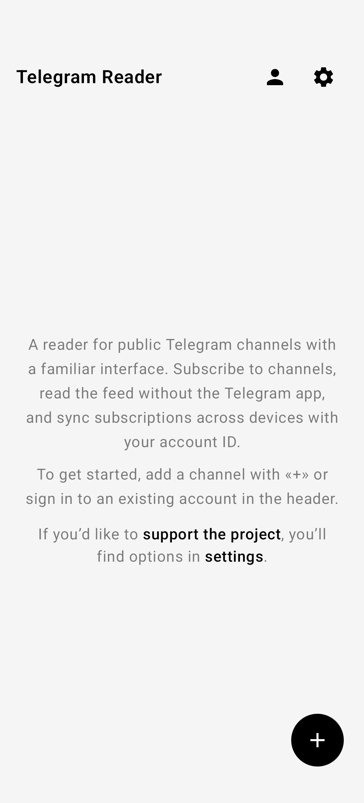
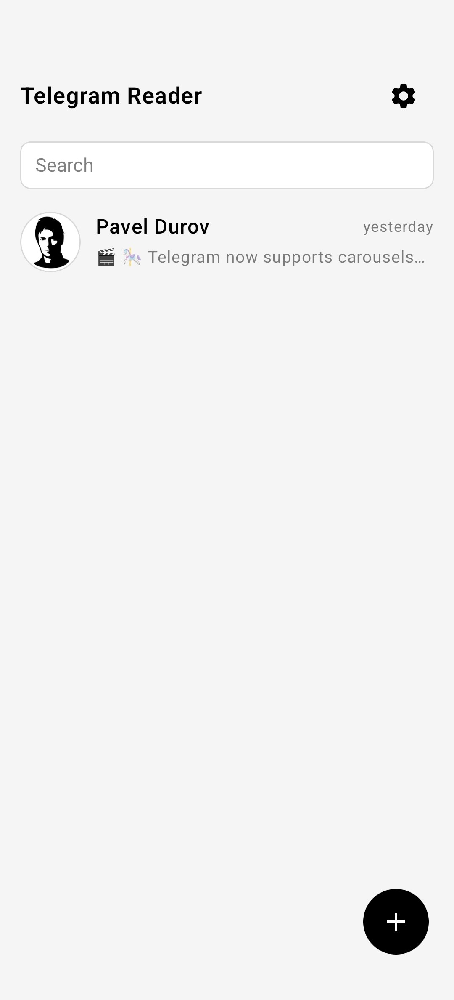
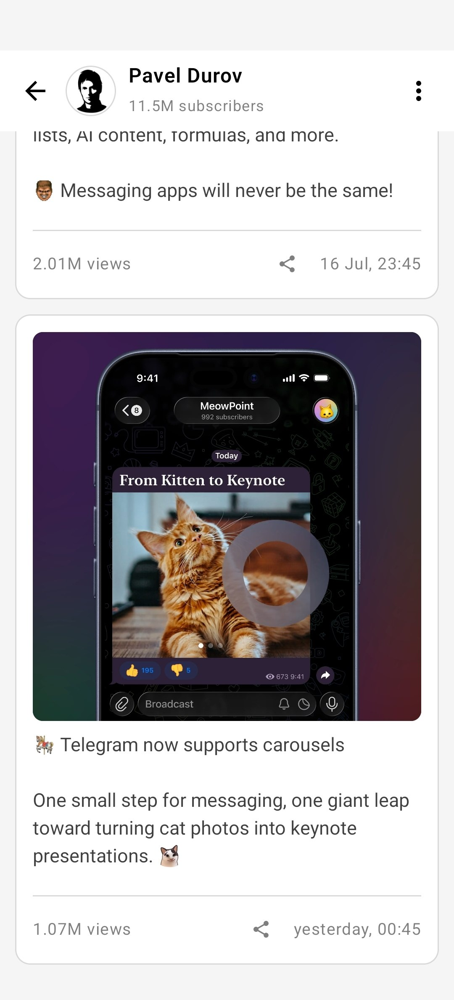

# Telegram Reader

Русская версия | [English version](./README.md)

Android-приложение для чтения публичных Telegram-каналов в привычном интерфейсе. Подписывайтесь на каналы, читайте ленту без клиента Telegram и синхронизируйте подписки между устройствами через ID аккаунта.

Веб-версия: [reader.duckpsycho.dev](https://reader.duckpsycho.dev/)

Последнюю версию можно загрузить в разделе "[Releases](https://github.com/duck-psycho/telegram-reader/releases)".

## Возможности

- Подписка на публичные каналы по `@username` или ссылке `t.me/…`.
- Лента постов с фото, видео, стикерами и форматированным текстом.
- Синхронизация подписок между Android и веб-версией через ID аккаунта.
- Тёмная тема.
- Кэш медиа (до 512 МБ) с ручной очисткой.
- Виджет рабочего стола с прокручиваемыми превью последних постов выбранного канала. Добавьте его через меню виджетов Android и выберите канал из подписок; обновление запланировано раз в 30 минут. Кнопка ↻ обновляет посты сразу.

## Скриншоты

  
  
  

## Поддержать разработчика

Если приложение оказалось полезным, вы можете поддержать разработчика донатом:

Boosty: https://boosty.to/duckpsycho/donate

BTC (Bitcoin): 178tovsfYQ8omdEPQSHAiH4jXBbBCWNacs

USDT, TRX (TRC20): TLD6QVdHhHNRDgRkYuqhUa2B9bkYgeRxmy

TON: EQDuRyrzSzP8dqbMVNwEBvan_LPK44uRAIuAoT_VF2BXQtS6

ETH (ERC20): 0xF7556e3969e520A677e91E2bFb90EA88bD57EaD9

SOL (Solana): 3tGbXMzqTu7av7DjriY7wkWGEEHxshEZN9SbFP4qBi8v

LTC (Litecoin): LfmZvRPM4zb6EtwnAn9ATLo8kK4Rw7JxUK

BNB: 0xF7556e3969e520A677e91E2bFb90EA88bD57EaD9